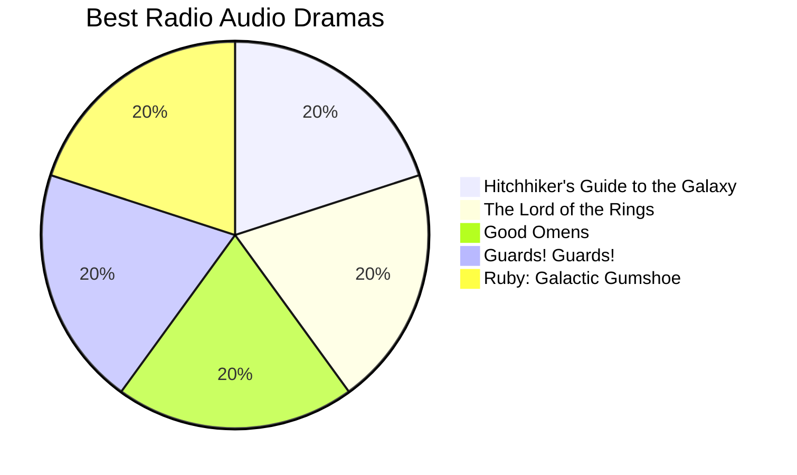

After adding [jekyll-spaceship](https://github.com/jeffreytse/jekyll-spaceship) to my Gemfile, I've found myself increasingly enamored with the plugin and all the nifty included markdown extensions, [mermaid](https://github.com/mermaid-js/mermaid) especially. 

Mermaid allows the creation of a variety of diagrams and charts by way of simple, [markdown-like syntax](https://mermaid-js.github.io/mermaid/#/./n00b-syntaxReference). The jekyll-spaceship gem makes this available within jekyll via codeblocks. 

This is particularly useful for generating high-level project use case charts, but this post will focus on pie charts for visualizing music listening stats. :)

## Last.fm API

I wrote about the [Last.fm API](https://www.last.fm/api/intro) in [this previous post](). 

To make a pie chart displaying the user's top 7 most listened artists for the week, the request URL will use the [`getWeeklyArtistChart`](https://www.last.fm/api/show/user.getWeeklyArtistChart) user method with a limit of `7`. 

~~~
https://ws.audioscrobbler.com/2.0/?method=user.getWeeklyArtistChart&user={username}&api_key={key}&format=json&limit=7
~~~

## Building a Pie Chart

The implementation of Mermaid in jekyll-spaceship allows conjuring diagrams by using codeblocks designated with `mermaid!`, followed by a declaration of diagram type and parameters / contents.

````
~~~mermaid! 
pie title Best Radio Audio Dramas
    "Hitchhiker's Guide to the Galaxy" : 42
    "The Lord of the Rings" : 42
    "Good Omens" : 42
    "Guards! Guards!" : 42
    "Ruby: Galactic Gumshoe" : 42
~~~
````
*^ May need to replace the tildes with backticks. ^*

The above block will produce a ***`pie`*** chart with a ***`title`*** of 'Best Radio Audio Dramas', where each of the subsequent k:v pairs are charted according to proportion of their values:

<div style="background: white;">

</div><br>

The `write_md()` function from the [previous post]() can be used again to construct the final markdown file. 

~~~python
def write_md(text):
    """Write data to Jekyll post formatted md file"""
    md_file = f'./{date}-weekly-music-stats.md'
    with open(md_file, 'a') as md:
        md.write(text+"\n")
~~~

The start and end of the mermaid code block are static and can be assigned to strings to be pushed to the outfile. 

*using ``{'`'*3}`` to avoid executing mermaid code in post, can be written normally in python script*

```python
PIE_START = f"""
{'`'*3}mermaid!
pie title Top 7 Artists - {date}"""

PIE_END = f"{'`'*3}"
```

## Populating with data parsed from Last.FM API

Now, we can write a function to populate the rest of our chart with artists and playcounts from the API response.  

Rows can be constructed from the response JSON like so:

```python
for item in response['weeklyartistchart']['artist']:
        row = f'    "{item['name']}" : {item['playcount']}'
```

Our final function ties everything together:

~~~python
def pie_chart():
    url = f'https://ws.audioscrobbler.com/2.0/?method=user.getweeklyartistchart&user={username}&api_key={key}&format=json&limit=7'
    response = requests.get(url).json()
    write_md(PIE_START)
    for item in response['weeklyartistchart']['artist']:
        row = f'    "{item['name']}" : {item['playcount']}'
        write_md(row)
    write_md(PIE_END)
~~~
